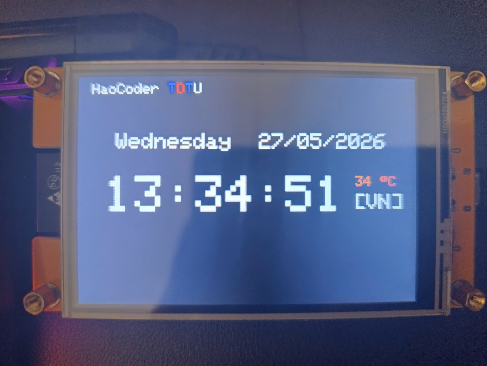

# CYD Multi-Timezone & Real-Time Weather Clock

A sleek, minimalist digital clock station built on the CYD platform. This project connects to multiple pre-configured Wi-Fi networks dynamically, syncs exact atomic time via NTP, fetches live localized weather data through the OpenWeatherMap API, and presents an interactive user interface on a TFT display.

---

## 💡 The Core Idea

The main objective of this project is to build an intelligent, portable, and low-latency **World Clock & Micro-Weather Station**. 

### Key Features:
* **Multi-Network Auto-Connect**: Seamlessly scans and switches through a list of multiple Wi-Fi access points (e.g., Home, University LAB, Mobile Hotspot). If a connection fails, it retries cleanly and automatically triggers a system restart to prevent indefinite freezes.
* **Smart Time Syncing & DST Handling**: Connects to Google's NTP server to sync time. Features an interactive **hardware interrupt switch (BOOT button)** to cycle through multiple country timezones (Vietnam, USA, France, Japan) in real-time.
* **Contextual Weather & Dynamic UI**: Queries localized meteorological metrics based on coordinates or city data. The interface changes its layout and character colors dynamically based on current temperature and weather conditions (e.g., turning yellow during clear skies or blue during heavy rain).

---

## 🛠️ Hardware Requirements

This project is built using embedded system architectures and highly responsive SPI-driven peripherals.

* **Microcontroller**: CYD Development Board (e.g., CYD-32E NodeMCU)
* **Display**: TFT LCD Module driven by the ST7789/ILI9488 controller (configured via high-speed SPI connection)
* **Display Driver Pins**:
  * `LCD_CS`: Pin 15 (Chip Select)
  * `Backlight (LED)`: Pin 27
* **Input Controller**: On-board `BOOT Button` (GPIO 0) utilizing internal `INPUT_PULLUP` resistor configurations to switch timezones seamlessly.

---

## 📚 Libraries Used

The software architecture leverages optimized open-source embedded libraries to parse network protocols and render high-refresh-rate graphics.

1. **`WiFi.h`** *(Built-in CYD Core)*: Manages 802.11 b/g/n Wi-Fi connection states, network reconnections, and multi-profile handshakes.
2. **`HTTPClient.h`** *(Built-in CYD Core)*: Facilitates lightweight HTTP `GET` requests to query remote cloud APIs.
3. **`time.h`** *(Built-in C Core)*: Formats raw UNIX timestamps into readable standard calendars, track days of the week, and compute precise time structures (`struct tm`).
4. **`TFT_eSPI`** *by Bodmer*: A highly optimized graphics rendering engine for TFT displays. Offers superior FPS by talking directly to the CYD’s native hardware SPI.
5. **`ArduinoJson`** *by Benoît Blanchon (v6.x)*: An efficient JSON serialization/deserialization library used to parse weather payloads received from the OpenWeatherMap satellite servers.

---

### UI Highlights:
* **Top Left**: Custom branding acknowledging ownership (`HaoCoder`) alongside university identity (`TDTU` rendered in official institutional colors).
* **Top Right**: Live network configuration feedback along with contextual weather metrics.
* **Center Screen**: Epoch-synced standard clock with real-time scaling adjustments.
* **Bottom Center**: Integrated dynamic custom graphics assets (such as an animated retro character or pulsing ASCII art) reacting directly to system tick cycles. *Optional*

## 🖼️ Demo & User Interface

